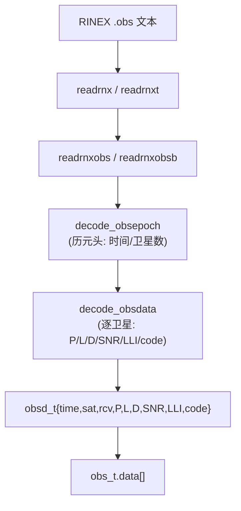

# Week 01 — RINEX 观测数据 → obsd_t 数据流图

> 目标：从一行 RINEX 观测文本追踪到内存中的 `obsd_t` 与 `obs_t.data`。
> 阅读 `src/rinex.c` 后逐步补全各步骤说明（文件/函数/行号）。

## 1. 顶层数据流

```text
RINEX observation text
  -> readrnx / readrnxt
  -> readrnxobs / readrnxobsb
  -> decode_obsepoch + decode_obsdata
  -> obsd_t { time, sat, rcv, P, L, D, SNR, LLI, code }
  -> obs_t.data
```

## 2. Mermaid 图（补全后维护）



## 3. 逐步说明（精读后填写）

| 步骤 | 函数 | 位置 | 输入 → 输出 | 批注 |
|---|---|---|---|---|
| 1 | `readrnx` / `readrnxt` | `src/rinex.c` | | |
| 2 | `readrnxobs` / `readrnxobsb` | | | |
| 3 | `decode_obsepoch` | | | |
| 4 | `decode_obsdata` | | | |
| 5 | `obs_t` 组装 | | | |

## 4. 待确认问题

- `LLI` 与 `code` 在 RINEX 各版本中的解析差异？
- `obsd_t.rcv` 何时非 0？
- 单历元内多系统（GPS/GLO/GAL/BDS）如何混排？
