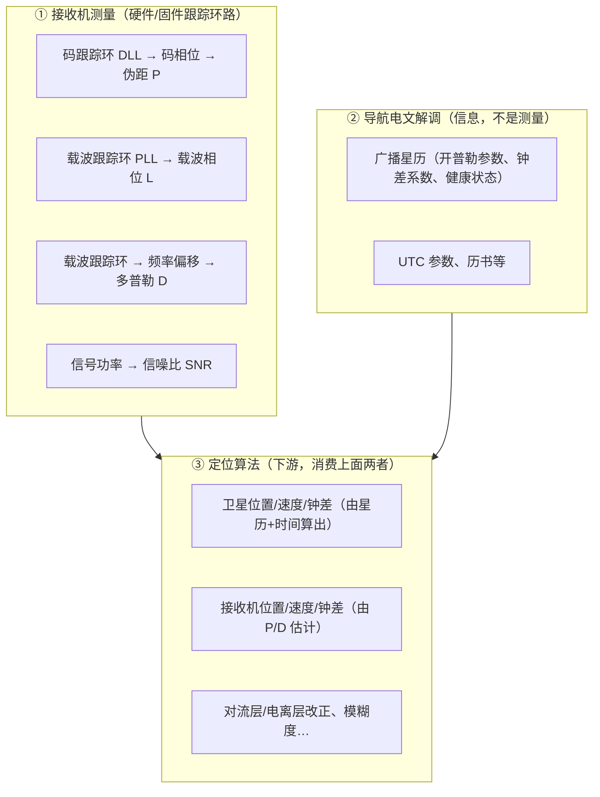

# A4 观测数据流

> 对应知识点：**A4 观测数据流**（模块 A：观测与基础，⏱ 3h）
>
> 目标：讲清一行 RINEX 观测如何进入 `obsd_t`/`obs_t`；分清"接收机测量 / 电文信息 / 算法计算"三来源。
>
> 状态：📝 进行中 / ✅ 已完成

## 1. 观测量从哪来：测量 vs 电文 vs 计算



- **① 是"测量"**：$P/L/D/SNR$ 是接收机锁星后由跟踪环路（DLL/PLL）直接测出的**原始观测量**，直接进入接收机输出（RINEX `.o` / RTCM MSM / 厂商原始格式如 u-blox、NovAtel）。
- **② 是"信息"**：广播星历是接收机从导航电文里**解调**出来的（开普勒参数、钟差系数…），描述"卫星在哪、钟差多大"，本身不是测量。它与测量是两路独立来源。
- **③ 是"计算"**：定位算法消费 ① 的测量 + ② 的星历，算出卫星位置、接收机位置/速度/钟差、改正量、模糊度等。

## 2. RINEX → obsd_t 数据流

`readrnx → decode_obsdata → obsd_t` **只搬运、不计算**：

```text
接收机固件测好 P/L/D/SNR
  → 写入 RINEX .o（或实时 RTCM 流）
  → RTKLIB 解析（只做单位统一：P→m、L→cycle、D→Hz、SNR→0.001dBHz）
  → obsd_t
  → 定位算法消费
```

调用链（`src/rinex.c`）：

```text
RINEX observation text
  -> readrnx / readrnxt
  -> readrnxobs / readrnxobsb
  -> decode_obsepoch + decode_obsdata
  -> obsd_t { time, sat, rcv, P, L, D, SNR, LLI, code }
  -> obs_t.data
```

> 观测文件（`.o`）装**测量值**，导航文件（`.n`）装**电文信息**，两条路最后在 `rtkpos()` 汇合。

## 3. 实验记录

### 3.1 构建 `rnx2rtkp`

```text
命令：make -C app/consapp/rnx2rtkp/gcc
依赖/问题记录：
```

### 3.2 调试 `decode_obsdata()`，观察第一个有效历元的 2~3 颗 GPS 卫星

| sat | code | P (m) | L (cycle) | D (Hz) | SNR (0.001dBHz) | LLI | λ (m) | L×λ (m) |
|---|---|---|---|---|---|---|---|---|

- `satno2id()` 转卫星号：
- `code2obs()` 转码类型：
- `sat2freq()` 算波长，验证 $L\times\lambda$ 量级接近几何距离（含未知整周常数）。

### 3.3 现象解释

```text
L×λ 为什么不是正好等于几何距离？
```

## 4. 口述验收

- `code[]` 为什么不能只用数组下标替代？（答案：code 标识"频点+码型"，不同星座/码型对应不同频率与精度，且同一频点可有多种码；只有数组下标区分不了）
- 卡住的位置记录：

## 5. 问题清单

| # | 问题 | 答案 | 未解/待验证 |
|---|---|---|---|
| 1 | | | |
| 2 | | | |
