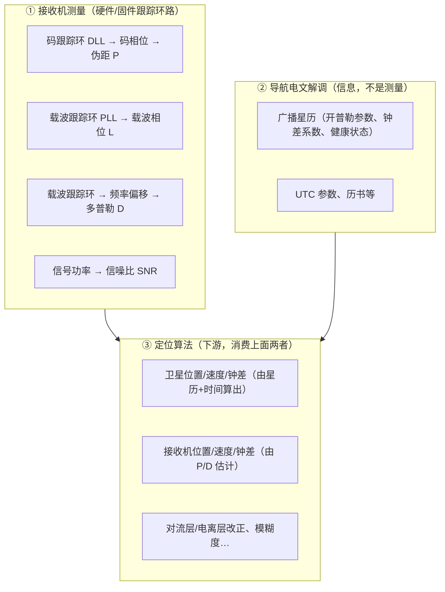

# A4 观测数据流

> 对应知识点：**A4 观测数据流**（模块 A：观测与基础，⏱ 3h）
>
> 目标：讲清一行 RINEX 观测如何进入 `obsd_t`/`obs_t`；分清"接收机测量 / 电文信息 / 算法计算"三来源。
>
> 状态：✅ 已完成（理论 + 源码 + 实验；下午做口述复盘）

## 1. 观测量从哪来：测量 vs 电文 vs 计算



- **① 是"测量"**：$P/L/D/SNR$ 是接收机锁星后由跟踪环路（DLL/PLL）直接测出的**原始观测量**，直接进入接收机输出（RINEX `.o` / RTCM MSM / 厂商原始格式如 u-blox、NovAtel）。
- **② 是"信息"**：广播星历是接收机从导航电文里**解调**出来的（开普勒参数、钟差系数…），描述"卫星在哪、钟差多大"，本身不是测量。它与测量是两路独立来源。
- **③ 是"计算"**：定位算法消费 ① 的测量 + ② 的星历，算出卫星位置、接收机位置/速度/钟差、改正量、模糊度等。

## 2. RINEX → obsd_t 数据流

`readrnx → decode_obsdata → obsd_t` **只搬运、不计算**：

```text
接收机固件测好 P/L/D/SNR
  → 写入 RINEX .o（或实时 RTCM 流）
  → RTKLIB 解析（只做单位统一：P→m、L→cycle、D→Hz、SNR→0.001dBHz）
  → obsd_t
  → 定位算法消费
```

调用链（`src/rinex.c`）：

```text
RINEX observation text
  -> readrnx / readrnxt
  -> readrnxobs / readrnxobsb
  -> decode_obsepoch + decode_obsdata
  -> obsd_t { time, sat, rcv, P, L, D, SNR, LLI, code }
  -> obs_t.data
```

> 观测文件（`.o`）装**测量值**，导航文件（`.n`）装**电文信息**，两条路最后在 `rtkpos()` 汇合。

### 2.3 `obsd_t`：解码后的“观测记录”结构（`src/rtklib.h`）

```c
typedef struct {                /* observation data record */
  gtime_t time;                 /* receiver sampling time (GPST) */
  uint8_t sat, rcv;             /* satellite/receiver number */
  uint16_t SNR[NFREQ + NEXOBS]; /* signal strength (0.001 dBHz) */
  uint8_t LLI[NFREQ + NEXOBS];  /* loss of lock indicator */
  uint8_t code[NFREQ + NEXOBS]; /* code indicator (CODE_???) */
  /* 载波相位 */
  double L[NFREQ + NEXOBS]; /* observation data carrier-phase (cycle) */
  /* 伪距 */
  double P[NFREQ + NEXOBS]; /* observation data pseudorange (m) */
  /* 多普勒频移 */
  float D[NFREQ + NEXOBS]; /* observation data doppler frequency (Hz) */
} obsd_t;
```

- 单位：$P\to$ m、$L\to$ cycle、$D\to$ Hz（`float` 省内存）、$SNR\to$ `0.001 dBHz`（`uint16_t`，45.0 dBHz 存 45000）。
- `code[]` 是 `CODE_???` 枚举值（`uint8_t`），**不是字符串**；频点用下标 `f` 表示，`code[f]` 记录该频点具体码型。
- 一个 `obsd_t` = **一颗卫星在一个历元**的全部频点观测；一个历元 = 多条 `obsd_t`（每颗卫星一条）。

### 2.4 `code` 是怎么来的：`convcode()` → `obs2code()`

RINEX 2 观测类型只有 4 字符（`L1 C1 L2 P2`），**没有标准码型**；RINEX 3 才有 `1C/2W/2L…` 码型。

```text
RINEX 2 头部 "# / TYPES OF OBSERV"  →  convcode()  →  RINEX 3 码型字符串 →  obs2code()  →  CODE_??? 枚举
  "C1" (L1 C/A 伪距)                  →  "1C" (GPS/GLO C/A)             →  CODE_L1C = 1
  "P2" (L2 P 码伪距)                  →  "2W" (GPS L2 半周码)           →  CODE_L2W = 20
```

- `convcode()`（`src/rinex.c:263`）：RINEX 2 类型 → RINEX 3 码型，按**星座 + 版本**区分（如 `P1` 在 GPS→`1W`、GLO→`1P`；`C1` 在 v≥2.12 被拒）。
- `obs2code()`（`src/rtkcmn.c`）：在 `obscodes[]` 表中找下标 → 返回枚举（`code`）。
- 同一频点可有多种码（L1: `1C/1P/1W/1X…`），`setcodepri()` 的优先级（`codepris[][]`）在 `set_index()` 中决定 `pos[]`（存到哪个频点槽）。

### 2.5 `decode_obsdata()`：一行观测 → `obsd_t`（`src/rinex.c:746`）

1. **卫星号**：`satid2no("G03")` → 内部号 `sat`。
2. **读字段**：RINEX 2 每 14 字符一字段（`str2num(buff,j,14)`），RINEX 3 每 16 字符；可加相位偏移 `ind->shift[i]`。
3. **按类型入库**：`ind->type[i]`（C/L/D/S）决定写 `P/L/D/SNR`，`p[i]`（频点索引）决定写第几个槽；`val==0` 跳过。
   - 一频多码按 `setcodepri` 优先级选一个写进 `pos[]` 槽（RINEX ≤2.11 有 C1/P1、C2/P2 取舍逻辑）。
   - `LLI`：`str2num(buff,j+14,1)&3` 只取低 2 位。
   - `SNR`：`(uint16_t)(val/SNR_UNIT+0.5)` = ÷0.001 四舍五入。

## 3. 实验记录

### 3.1 构建 `rnx2rtkp` ✅

```text
1) apt-get install -y gfortran            # iers.a 需要 Fortran 编译器
2) make -C lib/iers/gcc                   # 产出 lib/iers/gcc/iers.a
3) make -C app/consapp/rnx2rtkp/gcc       # 产出 rnx2rtkp（2.8MB）
产物：app/consapp/rnx2rtkp/gcc/rnx2rtkp
坑：rtklib.h 中学习用中文注释写成 // 风格 → C90(-ansi -pedantic) 编译报错，
    已改成 /* */ 风格（保留中文内容）
```

### 3.2 实验：直接调 `readrnx()` 观察 `obsd_t` ✅

实验程序：`learn/experiments/a4_dump_obs.c`（`readrnx → sortobs → 打印`，复用 rnx2rtkp 已编译对象）

```text
运行：learn/experiments/a4_dump_obs test/data/rinex/07590920.05o test/data/rinex/07590920.05n
结果：total obs = 948；首个历元 2005/04/02 00:00:00 GPST，8 颗 GPS
      （G03 G07 G08 G11 G19 G20 G24 G28），每颗 L1+L2 两个频点
```

首个历元 L1（`code=1C`，λ=0.1903 m）：

| sat | P (m) | L (cycle) | L×λ (m) | (P−L×λ)/λ |
|---|---|---|---|---|
| G03 | 24767686.375 | 55923622.160 | 10641911.457 | 74231448.215 |
| G07 | 24361933.475 | −691177.898 | −131526.781 | 128714002.392 |
| G08 | 23407378.219 | 17984490.035 | 3422334.662 | 105022112.732 |
| G11 | 20311445.258 | 7712103.227 | 1467564.448 | 99025262.022 |
| G19 | 22613015.950 | 36724126.590 | 6988368.929 | 82108074.279 |
| G20 | 21565852.190 | −5764048.758 | −1096862.008 | 119093366.926 |
| G24 | 22276378.821 | −2292750.457 | −436295.905 | 119355911.273 |
| G28 | 21543408.487 | −5448227.324 | −1036763.188 | 118659603.037 |

L2（`code=2W`，λ=0.2442 m）示例：G03 `P=24767684.822`、`L=43647388.242`，$(P-\lambda L)/\lambda=57772140.756$。

- `satno2id()` 转卫星号：内部号 3 → `"G03"`，28 → `"G28"`。
- `code2obs()` 转码类型：`1` → `"1C"`，`20` → `"2W"`。
- `sat2freq()` 算频率/波长：L1→1575.42 MHz→0.1903 m，L2→1227.60 MHz→0.2442 m。
- **注意**：RINEX 2.10 老格式**没有多普勒和 SNR 字段**，故实验输出 `D=0、SNR=0`；RINEX 2.11/3 才有。

### 3.3 现象解释：$L\times\lambda$ 为什么≠ 几何距离？

把伪距和载波相位的观测方程相减（下标省略）：

$$
P=\rho+c(\delta t_r-\delta t^s)+I+T+B_P+\epsilon_P
$$

$$
\lambda L=\rho+c(\delta t_r-\delta t^s)-I+T+\lambda N+B_L+\epsilon_L
$$

$$
\frac{P-\lambda L}{\lambda}=N+\frac{2I+(B_P-B_L)+\epsilon}{\lambda}
$$

- **$N$ 是未知整周模糊度（亿级大整数）**：相位只能测“分数周”，整周数未知 → `L×λ` 与几何距离差一整周数的波长，这就是表的第 6 列高达 亿级 的原因。
- **$2I$ 电离层（P 与 L 反号，相减后加倍）**：伪距电离层是“延迟”$+I$，相位电离层是“超前”$-I$，相减变 $2I$ → 造成第 6 列的**小数残余**（0.02~0.93 周 ≈ 0.4~18 cm），且每颗卫星不同。
- **$(B_P-B_L)$ 硬件码/相位偏差 + 噪声**：再叠加一点小数残余。

结论：$L$ 是“几何距离 + 未知整周 + 反号电离层”的**高精度**量（相位噪声毫米级）；$P$ 是**无模糊度但低精度**（噪声米级）。这也为 B 模块“双差消模糊度之外的误差、用相位精度”埋下伏笔。

## 4. 口述验收

- `code[]` 为什么不能只用数组下标替代？

  **答案**：`code[f]` 记录的是第 `f` 个频点上**具体是哪种码型**（`1C/2P/2W/5X…`）。同一频点可有多种码（如 L1 有 `1C/1P/1W/1X`），它们的频率相同但**精度、抗多径、可用性、电离层组合权重不同**；不同星座码型对应的物理含义也不同。只靠数组下标只能表示“第几个频点”，丢失了“用的哪种码”这一信息，无法做：
  1. 码型选择（`setcodepri` 优先级）；
  2. 频率换算（`code2freq/sat2freq` 需按码型查表）；
  3. 码偏差/双频组合（需知道码型才能查 DCB、做电离层组合）。
- 卡住的位置记录：暂无（构建时卡在 `//` 注释，已解决）。

## 5. 问题清单

| # | 问题 | 答案 | 未解/待验证 |
|---|---|---|---|
| 1 | | | |
| 2 | | | |
