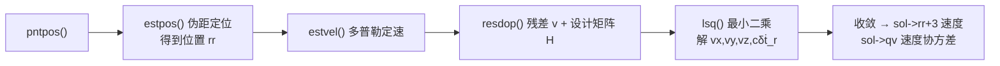
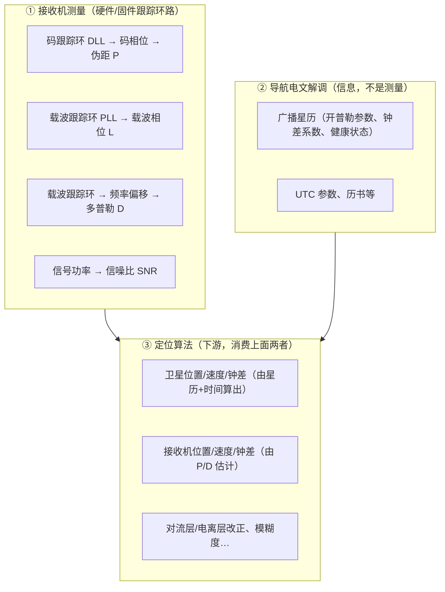

# Week 01 — 观测量、时间、坐标与数据结构笔记

> 本周核心问题：RINEX 中的一行观测进入 RTKLIB 后以什么单位保存？时间、卫星编号、频点和码类型如何关联？
>
> 状态：📝 进行中 / ✅ 已完成（完成后勾选）

## 1. 基本观测方程（手推区）

### 1.1 伪距 $P_r^s$（单位：m）

$$P_r^s=\rho_r^s+c(\delta t_r-\delta t^s)+T_r^s+I_r^s+d_{P,r}-d_P^s+\epsilon_P$$

逐项含义（单位 / 符号 / 误差来源 / 可观性）：

| 项 | 含义 | 单位 | 备注 |
|---|---|---|---|
| $\rho_r^s$ | 几何距离 | m | |
| $c(\delta t_r-\delta t^s)$ | 接收机/卫星钟差 | m | |
| $T_r^s$ | 对流层延迟 | m | |
| $I_r^s$ | 电离层延迟 | m | 伪距超前、相位滞后 |
| $d_{P,r}, d_P^s$ | 码硬件延迟 | m | 见下方"可观性与吸收" |
| $\epsilon_P$ | 噪声 | m | |

> 📌 **$d$ 是什么：硬件延迟（hardware delay）。** $d_{P,r}$ 是信号经过接收机天线/射频/基带链路产生的固定时延，$d_P^s$ 是信号在卫星生成和发射链路的固定时延。单位已折算成 m。
>
> **为什么常见教材里看不到这两个量——不是被忽略，而是被"吸收"进钟差：**
>
> 1. **接收机端不可分离**：$\delta t_r$ 与 $d_{P,r}$ 以完全相同的方式进入方程，只能估计组合 $c\delta t_r^{\text{eff}}=c\delta t_r+d_{P,r}$，所以 SPP 里 $d_{P,r}$ 被并入接收机钟差。
> 2. **卫星端已被广播星历吸收**：广播星历的钟差是用码观测拟合的"码钟差"，内部已含 $d_P^s$；跨频点时再用 **TGD（Timing Group Delay）** 扣除频点差异。
>
> **什么时候"藏不住"、必须显式出现：**
>
> | 场景 | 原因 | RTKLIB 的处理 |
> |---|---|---|
> | 多星座（GPS+GLO+GAL+BDS） | 各系统接收机延迟不同，一个钟差吸收不了 | 增加**系统间偏差 ISB** 状态（第 3 周 `pntpos()`） |
> | 多频点 | 同一接收机不同频点码延迟不同 | DCB / IFB，`prange()` 里的 TGD 改正 |
> | 载波相位 | 相位硬件延迟与模糊度线性相关 | 被 $\lambda N$ 吸收，故 1.2 的 $d_\Phi$ 常被省略 |
>
> **结论**：$d_{P,r}$、$d_P^s$ 理论存在、实际不分别估计——伪距端被钟差/TGD 吸收，相位端被模糊度吸收；学到多星座、多频点时会以 ISB、DCB 的形式"回来"。

### 1.1b 码相位与伪距噪声（讨论注记）

**码相位是什么**：接收机靠相关器让本地码与接收码对齐，测得接收码在**整个码序列周期内的延迟** $\tau$（0～1 个码周期）。以 GPS C/A 码为例：码长 1023 chips、周期 1 ms、一个码片 ≈ 293 m，所以码相位范围 ≈ 0～300 km，精度可到亚码片。

```text
测得总时延 = 整码周期数 × 码周期 + 码相位（周期内延迟）
                ↑ 未知(≈300 km模糊)      ↑ 能测到(亚码片)
```

**为什么亚码片最不准**：相关函数在码片对齐处是尖峰，峰顶附近的斜率最大处决定精度。整码片部分（第几个码片）看得很稳；但峰的小数位置只要有一点噪声/多径就会抖动，**误差几乎全部集中在亚码片**。

| 误差源 | 机制 | 典型量级 |
|---|---|---|
| 热噪声 | 峰顶抖动（受 C/N₀ 与带宽限制） | 0.3～1 m |
| **多径** | 反射信号扭曲相关峰形状，把峰整体拉偏 | 典型 1～3 m，**恶劣可达几十 m** |
| 码率/量化 | 码片宽 293 m，粗相关器分辨率差 | 与带宽相关 |

> 所以"几十米"量级通常来自**多径**，而不是基本热噪声。这也是"码粗、载波精"的原因：码用于粗定位/定初始（几百 m 内无模糊），载波用于毫米级精测（代价是整周模糊度）。

### 1.2 载波相位 $\lambda\Phi_r^s$（单位：m）

$$\lambda\Phi_r^s=\rho_r^s+c(\delta t_r-\delta t^s)+T_r^s-I_r^s+\lambda N_r^s+d_{\Phi,r}-d_\Phi^s+\epsilon_\Phi$$

> 注意与伪距的三个不同点：电离层符号相反、多出整周模糊度 $\lambda N_r^s$、硬件偏差不同。

### 1.2b 载波相位解读：整周模糊度（讨论注记）

**符号含义**：$\Phi_r^s$ 为载波相位观测值（cycle），左端 $\lambda\Phi_r^s$ 换算成 m；$\lambda$ 为波长（GPS L1≈0.1903 m）；$N_r^s$ 为**整周模糊度**（未知整数，cycle），$\lambda N_r^s$ 为其对应米数；$d_{\Phi,r}$、$d_\Phi^s$ 为相位硬件延迟（被 $N$ 吸收，常省略）。

**与伪距方程只有三点不同**：

| 项 | 伪距 $P$ | 载波相位 $\lambda\Phi$ |
|---|---|---|
| 几何距离 $\rho$、钟差、对流层 $T$ | ✅ | ✅ |
| 电离层 $I$ | **$+I$（延迟）** | **$-I$（超前）** |
| 整周模糊度 $\lambda N$ | ❌ | ✅ 多出 |
| 噪声 | 分米~米级 | **毫米级** |

1. **电离层符号相反**：电离层使码（群速度）变慢、相位（相速度）变快，所以 $+I$ 与 $-I$。
2. **多出 $\lambda N$**：接收机只能测不足一周的小数部分 + 锁定后的整周计数增量，**初始整周数不可知**，这就是整周模糊度。
3. **噪声小得多**：毫米级 vs 分米/米级，这正是载波"精确"的来源。

**轮子类比**：匀速转动的轮子，你能看到它现在停在哪个角度（小数部分），也能数从观察起转了几圈（计数增量），但**不知道观察前已转了几圈**——初始圈数就是 $N$。

**码 vs 载波测量对照**：

| | 码相位 | 载波相位 |
|---|---|---|
| 测的位置 | 码周期内（0~1023 chips≈300 km） | 载波周期内（0~1 周≈19 cm） |
| 精度 | 分米~米（亚码片） | 毫米（亚周） |
| 整周模糊 | **无**：靠电文时间分层定绝对发射时刻 | **有**：≈19 cm 间隔，要专门解算 |
| 定位用途 | 粗定位 + 定初始 | 精测量（差分/LAMBDA 解 $N$） |

> 由此回答第 1 周口述验收：**为什么 $L$ 不能直接当米用**——$L$ 单位是 cycle、含未知整数 $N$，须先乘 $\lambda$ 并解出 $N$ 才是距离。

### 1.3 多普勒 $D_r^s$（单位：Hz）

$$D_r^s\lambda\approx-\dot\rho_r^s-c(\dot{\delta t}_r-\dot{\delta t}^s)+\epsilon_D$$

### 1.3b 用多普勒定速（讨论注记）

**思路**：多普勒 $D$ 乘波长就是**距离变化率**（m/s），减去卫星速度在视线上的投影和卫星钟漂，剩下的就是"接收机速度在视线上的投影 + 接收机钟漂"，≥4 颗卫星用加权最小二乘解出。

**推导**：几何距离变化率只依赖视线方向的相对速度：

$$\dot\rho_r^s=\mathbf e_r^s\cdot(\dot{\mathbf r}^s-\dot{\mathbf r}_r)$$

代入多普勒方程、把未知量挪到一边，状态为 $[v_x,v_y,v_z,c\dot\delta t_r]^T$（4 个未知）：

$$\underbrace{\mathbf e\cdot\dot{\mathbf r}_r-c\dot{\delta t}_r}_{\text{未知}}=\underbrace{\mathbf e\cdot\dot{\mathbf r}^s-c\dot{\delta t}^s-D\lambda}_{\text{可算}}$$

**雅可比（与伪距完全同构）**：速度块 $-e^T$（对接收机速度求导），钟漂列 $+1$。所以"多普勒定速"= "伪距定位"换观测量、状态换成速度，数学骨架相同。

**RTKLIB 实现**（`src/pntpos.c`）：`pntpos()` 位置解成功后调 `estvel()`，`estvel()` 迭代调 `resdop()` 逐星算残差 `v` 和设计矩阵 `H`，再用 `lsq()` 解：



**关键代码逐行对照**（`resdop()`，约 `src/pntpos.c:548`）：

```c
/* 多普勒观测转 m/s —— 注意负号：接近时 D>0 但距离减小 */
v[nv]=(-obs[i].D[0]*CLIGHT/freq-(rate+x[3]-CLIGHT*dts[1+i*2]))/sig;
/*       ^-D·λ 观测          ^预测=ρ̇+cδṫ_r-cδṫ^s    ^除以σ加权 */

vs[j]=rs[j+3+i*6]-x[j];                       /* 卫星速度相对接收机速度 */
rate=dot(vs,e,3)+OMGE/CLIGHT*(...);           /* ρ̇ = e·vs + 地球自转改正 */

for (j=0;j<4;j++) H[j+nv*4]=((j<3)?-e[j]:1.0)/sig;  /* 速度块 -e，钟漂列 +1 */
```

**容易踩的 5 个点**：

1. **负号**：观测项是 $-D\lambda$（`-obs[i].D[0]*CLIGHT/freq`），教材符号可能相反，以代码为准。
2. **视线向量**：由 `azel` 构造 ENU 视线再乘 `E` 矩阵转 ECEF——正好用到本周 ECEF↔ENU 旋转。
3. **地球自转改正**：`rate` 里的 `OMGE/CLIGHT×(...)` 与伪距 Sagnac 同源，不是额外状态。
4. **加权**：`sig=err·λ`，残差和 H 都除以 `sig` = 把 R 归一化成单位阵再喂 `lsq()`。
5. **门槛**：需 ≥4 条有效多普勒，且 `estvel()` 只在位置解**成功**后调用（`if (stat) estvel(...)`）。

> 一句话：多普勒定速与伪距定位同构——测量从 $P$ 换成 $-D\lambda$、状态从位置换成速度，$H$ 都是速度块 $-e^T$、钟差列 $+1$。

### 1.4 观测量从哪来：测量 vs 电文 vs 计算（讨论注记）

**三个不同来源，别混在一起**：



- **① 是"测量"**：$P/L/D/SNR$ 是接收机锁星后由跟踪环路（DLL/PLL）直接测出的**原始观测量**，直接进入接收机输出（RINEX `.o` / RTCM MSM / 厂商原始格式如 u-blox、NovAtel）。
- **② 是"信息"**：广播星历是接收机从导航电文里**解调**出来的（开普勒参数、钟差系数…），描述"卫星在哪、钟差多大"，本身不是测量。它与测量是两路独立来源。
- **③ 是"计算"**：定位算法消费 ① 的测量 + ② 的星历，算出卫星位置、接收机位置/速度/钟差、改正量、模糊度等。

**数据流**：第一周读的 `readrnx → decode_obsdata → obsd_t` **只搬运、不计算**：

```text
接收机固件测好 P/L/D/SNR
  → 写入 RINEX .o（或实时 RTCM 流）
  → RTKLIB 解析（只做单位统一：P→m、L→cycle、D→Hz、SNR→0.001dBHz）
  → obsd_t
  → 定位算法消费
```

> 观测文件（`.o`）装**测量值**，导航文件（`.n`）装**电文信息**，两条路最后在 `rtkpos()` 汇合。

**$P$ 是不是"光速 × 时间"？——方向对，但要认清是"伪距"**：

$$P_r^s=c\,\tau_{\text{code}}$$

$\tau_{\text{code}}$ 是相关器让本地码与接收码对齐得到的**传播时延**。整码周期数**不需要初始位姿去猜**——卫星信号自身带**分层的绝对时间编码**：码相位（0~1 ms 内）→ 比特同步（1 bit=20 ms）→ 子帧/HOW（粗到 6 s），接收机逐层同步后**唯一确定信号发射时刻**；锁定后码 NCO 持续累计码周期数，伪距连续无模糊。但 $\tau_{\text{code}}$ 用的是接收机**本地钟**度量、路径还含大气与硬件延迟，所以乘光速得到的是含误差项的**伪距**，不是几何距离：

$$P=c\tau=\rho+c(\delta t_r-\delta t^s)+T+I+d_{P,r}-d_P^s+\epsilon_P$$

> 一句话：$P/L/D/SNR$ 是**接收机测的**（原始观测量），星历是**电文解调的**（信息），位置/速度/钟差/模糊度是**算法算的**；$P=c\tau$ 方向正确，但那是"伪距"。

## 2. 单位表（以本仓库 RTKLIB 2.4.3 b34 为准）

| 量 | 字段 | 单位 | 备注 |
|---|---|---|---|
| 伪距 | `obsd_t.P` | m | |
| 载波相位 | `obsd_t.L` | cycle（周） | 不是 m，须乘 $\lambda$ |
| 多普勒 | `obsd_t.D` | Hz | |
| 信噪比 | `obsd_t.SNR` | 0.001 dBHz | 本版本按此保存 |
| 卫星位置 | `eph_t`/`nav_t` | ECEF m | |
| 钟差 | `eph_t.dts` | s | |

> ⚠️ 常见误区：把 `L`（cycle）当米使用；忽略 `SNR` 的单位因子 0.001。

## 3. 时间系统复习

- GPST / UTC / GPS 周数 + 周内秒（TOW）
- 周数、周内秒如何互转：`gpst2time()` / `time2gpst()`
- 手推 ECEF → ENU 旋转矩阵（放在这里或单独一页）

```text
（此处贴上手推的旋转矩阵和示例）
```

## 4. 关键数据结构（源码精读记录）

- `gtime_t`：
- `obsd_t`：`time / sat / rcv / P / L / D / SNR / LLI / code`
- `obs_t`：`n / data[]`
- `eph_t`：
- `nav_t`：
- `sol_t`：

（每个结构体写：字段、单位、用途、初始化方式）

## 5. 时间/坐标转换函数（逐行批注）

- `gpst2time()` / `time2gpst()` / `timediff()`
- `pos2ecef()` / `ecef2pos()` / `ecef2enu()`
- `geodist()` / `satazel()`

> 至少 5 条行内批注（编号 ① ② ③ …，指向 `src/rtkcmn.c` 对应行）。

## 6. 实验记录

### 6.1 构建 `rnx2rtkp`

```text
命令 / 依赖问题记录：
```

### 6.2 调试 `decode_obsdata()`，观察第一个有效历元的 2~3 颗 GPS 卫星

| sat | code | P (m) | L (cycle) | D (Hz) | SNR (0.001dBHz) | LLI | λ (m) | L×λ (m) |
|---|---|---|---|---|---|---|---|---|

- `satno2id()` 转卫星号：
- `code2obs()` 转码类型：
- `sat2freq()` 算波长，验证 $L\times\lambda$ 量级接近几何距离（含未知整周常数）。

### 6.3 现象解释

```text
L×λ 为什么不是正好等于几何距离？
```

## 7. 本周口述验收（不看资料讲 10~15 min）

- 为什么 `L` 不能直接当米使用？
- `code[]` 为什么不能只用数组下标替代？
- 卡住的位置记录：

## 8. 问题清单

| # | 问题 | 本周答案 | 未解/待验证 |
|---|---|---|---|
| 1 | | | |
| 2 | | | |
